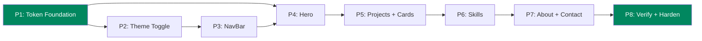

# Main Implementation Plan
## Portfolio Redesign — Play Store Inspired UI

> [!NOTE]
> Refined with [ui-ux-pro-max](file:///c:/projects/my-portfolio/.agent/skills/ui-ux-pro-max/SKILL.md) design intelligence. UI/UX rules sourced from the skill's searchable database (119 UX guidelines, 192 product palettes, 74 font pairings, 22 stacks).

---

## 1. Planning Basis

| Item | Source |
|---|---|
| **Architecture** | [`SYSTEM_ARCHITECTURE.md`](file:///c:/projects/my-portfolio/SYSTEM_ARCHITECTURE.md) — Next.js 16 App Router, Tailwind CSS v4, Vercel, `framer-motion` |
| **Specification** | [`redesign_specification.md`](file:///C:/Users/albue/.gemini/antigravity/brain/dd5c543f-3b23-43f8-8514-8e52659f953b/redesign_specification.md) — Play Store UI, Sections 2–7 |
| **Design System** | UI Pro Max `--design-system` output: Flat Design style, Play Store green palette, JetBrains Mono / IBM Plex Sans typography pairing (note: we keep existing Inter/Space Grotesk per spec — the system suggestion is informational only) |
| **Scope constraint** | Visual/presentational layer only. No routing, data-fetching, state, or business logic changes. |

**Assumptions verified against source:**

| Assumption | Verified? | Evidence |
|---|---|---|
| `framer-motion` installed | ✓ | [`package.json`](file:///c:/projects/my-portfolio/my-portfolio/package.json) line 16: `"framer-motion": "^12.40.0"` |
| Tailwind v4 with CSS `@theme` block | ✓ | [`globals.css`](file:///c:/projects/my-portfolio/my-portfolio/app/globals.css) line 3: `@theme {` — no `tailwind.config.ts` exists |
| All section components are `"use client"` | ✓ | Every file in [`components/sections/`](file:///c:/projects/my-portfolio/my-portfolio/components/sections) starts with `"use client"` |
| `NavBar` uses `useActiveSection` hook | ✓ | [`NavBar.tsx`](file:///c:/projects/my-portfolio/my-portfolio/components/NavBar.tsx) line 6, line 21 |
| `Projects.tsx` has `activeTag` filter state | ✓ | [`Projects.tsx`](file:///c:/projects/my-portfolio/my-portfolio/components/sections/Projects.tsx) line 12: `useState("All")` |
| Dark-only currently (no light mode) | ✓ | [`globals.css`](file:///c:/projects/my-portfolio/my-portfolio/app/globals.css) — single `@theme` block, no `:root` selectors |
| `layout.tsx` is a server component | ✓ | [`layout.tsx`](file:///c:/projects/my-portfolio/my-portfolio/app/layout.tsx) — no `"use client"` directive |
| `Toaster` uses hardcoded dark colors | ✓ | [`layout.tsx`](file:///c:/projects/my-portfolio/my-portfolio/app/layout.tsx) line 55: `background: '#13131A'` |
| `ScrollToTop` uses old violet accent shadow | ✓ | [`ScrollToTop.tsx`](file:///c:/projects/my-portfolio/my-portfolio/components/ScrollToTop.tsx) line 42: `rgba(108,99,255,0.2)` |
| `Education.tsx` exists but is out of redesign scope | ✓ | Component exists; spec has no Play Store analog for it |
| `next/link` used for internal navigation | ✓ | NavBar, ProjectCard use `Link` from `next/link` |

---

## 2. Dependency / Execution Strategy

**Ordering rationale:**

1. **P1 Tokens first** — Every component resolves its Tailwind classes (`bg-bg`, `text-accent`, etc.) from `globals.css`. If tokens are wrong, every component looks wrong. This is the single-point-of-failure foundation.
2. **P2 Theme toggle** — Must exist before any component can be meaningfully tested in both light and dark modes. Prevents rework.
3. **P3 NavBar** — Layout-critical sticky element that appears on every page. Must be done early to establish `scroll-padding-top` and spatial relationships for all subsequent sections.
4. **P4 Hero** — Depends on NavBar spatial positioning (sticky bar offset). Visual anchor for the entire page.
5. **P5 Projects** — Most complex phase: card restyle + featured horizontal row + filter chip restyle. Card hover/interaction patterns established here are reused in P6 and P7.
6. **P6 Skills** — Chip visual style must match P5's filter pills. Depends on P5 establishing that pattern.
7. **P7 About + Contact** — Lowest visual priority. Can reuse all tokens and patterns from P1–P6.
8. **P8 Verification** — Cross-browser, responsive, accessibility, and build audit. Catches contrast failures in the new light mode.

> Each phase produces a **shippable increment**. Deploy to Vercel preview after every merge.

---

## 3. Phase Overview

| Phase | Name | Objective | Dependencies | Deliverable |
|---|---|---|---|---|
| **P1** | Design Token Foundation | Replace CSS tokens with Play Store light/dark variable set | None | Updated `globals.css`; site renders in both modes |
| **P2** | Theme Toggle Infrastructure | Persistent light/dark toggle with FOVT prevention | P1 | `ThemeProvider`, `ThemeToggle` component |
| **P3** | NavBar Redesign | Sticky chip-row navigation with theme toggle | P1, P2 | Restyled `NavBar.tsx` with horizontal chip scroll |
| **P4** | Hero Redesign | Play Store featured banner card with pill CTAs | P1, P3 | Restyled `Hero.tsx` as rounded banner |
| **P5** | ProjectCard & Projects Section | Card restyle + Featured horizontal row + filter pills | P1, P4 | `ProjectCard.tsx`, `Projects.tsx` with two visual zones |
| **P6** | Skills Section | Category rail with chip rows | P1, P5 | Restyled `Skills.tsx` |
| **P7** | About, Contact & Peripherals | Developer Profile + form card + ScrollToTop + Toaster | P1, P6 | Restyled `About.tsx`, `Contact.tsx`, `ScrollToTop.tsx` |
| **P8** | Verification & Hardening | Responsive, a11y, build, and E2E audit | P1–P7 | Clean build; verified on all viewports/themes |

---

## 4. Detailed Phases

---

### Phase 1 — Design Token Foundation

**Objective**
Replace the single-mode dark tokens in [`app/globals.css`](file:///c:/projects/my-portfolio/my-portfolio/app/globals.css) with a dual light/dark CSS variable system matching the Play Store palette. Update the accent to Play Store Green.

**Scope**
- [`app/globals.css`](file:///c:/projects/my-portfolio/my-portfolio/app/globals.css):
  - Replace the flat `@theme` block with a structure that supports `[data-theme="dark"]` (default) and `[data-theme="light"]` selectors.
  - Add the `--color-divider` token (new).
  - Update `--color-accent` from violet (`#6C63FF`) to Play Store Green (`#01875F` light / `#4CAF93` dark).
  - Update shadow tokens to spec: `card` (`0 1px 2px rgba(0,0,0,0.08)`) and `card-hover` (`0 4px 12px rgba(0,0,0,0.12)`).
  - Update the `pulse-ring` keyframe from violet `rgba(108,99,255,...)` to green `rgba(1,135,95,...)`.
  - Add `scroll-padding-top` to `html` to prevent the sticky NavBar from obscuring focused content (UX guideline: Focus Not Obscured).
- **No component files are touched in this phase.**

**Architecture Components**
- `app/globals.css` — single source of truth for Tailwind v4 design tokens

**Dependencies**
- None. This is the prerequisite for all other phases.

**Major Deliverables**

| Token | Light | Dark |
|---|---|---|
| `--color-bg` | `#FFFFFF` | `#0F1115` |
| `--color-surface` | `#F1F3F4` | `#1B1D21` |
| `--color-text` | `#202124` | `#E8EAED` |
| `--color-muted` | `#5F6368` | `#9AA0A6` |
| `--color-accent` | `#01875F` | `#4CAF93` |
| `--color-divider` | `#E8EAED` | `#2A2D31` |
| `--shadow-card` | `0 1px 2px rgba(0,0,0,0.08)` | same |
| `--shadow-card-hover` | `0 4px 12px rgba(0,0,0,0.12)` | same |

**Acceptance Criteria**
- [ ] All 6 color tokens defined for both light and dark.
- [ ] Both shadow tokens defined.
- [ ] `scroll-padding-top` set on `html` (equal to NavBar height, approx `72px`).
- [ ] `pulse-ring` keyframe updated to green.
- [ ] `next build` completes without error.
- [ ] Manually toggling `data-theme` on `<html>` via DevTools swaps all token values correctly.

**UI/UX Quality Gates** *(sourced from ui-ux-pro-max)*
- [ ] **Contrast check (WCAG 2.2 AA)**: `--color-muted` on `--color-bg` must be ≥ 4.5:1 in both modes.
  - Light: `#5F6368` on `#FFFFFF` = **5.74:1** ✓
  - Dark: `#9AA0A6` on `#0F1115` = **5.89:1** ✓
- [ ] **Accent on bg contrast**: `--color-accent` must be ≥ 4.5:1 on `--color-bg`.
  - Light: `#01875F` on `#FFFFFF` = **4.56:1** ✓
  - Dark: `#4CAF93` on `#0F1115` = **6.89:1** ✓
- [ ] No raw hex values remain in component files — all reference token names only.

**Risks / Notes**
- Tailwind v4 resolves `--color-*` tokens directly via `@theme`. Existing class names (`bg-bg`, `text-text`, `bg-accent`) continue to work if token names match. Verify before touching components.
- The `:root[data-theme]` selector structure must work with Tailwind's `@theme` — may need CSS custom properties outside the `@theme` block with Tailwind's `@theme inline` or a `@layer` strategy. Test this first.

---

### Phase 2 — Theme Toggle Infrastructure

**Objective**
Implement a persistent, FOVT-free light/dark theme toggle mechanism that all subsequent phases depend on for dual-mode testing.

**Scope**
- [`app/layout.tsx`](file:///c:/projects/my-portfolio/my-portfolio/app/layout.tsx):
  - Add an inline `<script>` inside `<head>` (before React hydration) that reads `localStorage.getItem("theme")` and applies `data-theme` to `<html>`. Falls back to `prefers-color-scheme`. This prevents flash-of-wrong-theme (FOVT).
  - Add `suppressHydrationWarning` to `<html>` to avoid hydration mismatch from the inline script.
- New [`components/ThemeToggle.tsx`](file:///c:/projects/my-portfolio/my-portfolio/components/ThemeToggle.tsx):
  - A `"use client"` component with a sun/moon icon button (from `lucide-react`).
  - Reads and writes `localStorage`. Toggles `data-theme` on `<html>`.
  - Accepts `className` prop for positioning by consumers (NavBar in P3).
  - Uses `framer-motion` for icon transition (rotate + scale, 200ms).

**Architecture Components**
- `app/layout.tsx` — root layout (server component + inline script)
- New `components/ThemeToggle.tsx` — client component

**Dependencies**
- Phase 1 (tokens must exist for toggle to have visible effect)

**Major Deliverables**
- FOVT-free theme initialization script in `<head>`
- `ThemeToggle.tsx` component (exported, ready for NavBar consumption)
- Theme preference persists across hard refresh

**Acceptance Criteria**
- [ ] Clicking toggle switches `data-theme` between `"light"` and `"dark"` on `<html>`.
- [ ] Theme persists after hard refresh (stored in `localStorage`).
- [ ] First visit defaults to system `prefers-color-scheme`.
- [ ] No FOVT: page loads directly in the correct theme, no flash.
- [ ] `next build` completes without error.

**UI/UX Quality Gates**
- [ ] **Touch target**: Toggle button is at least 44×44px tap area (even if icon is smaller, use padding). *(UX: Touch Target Size — min 44pt iOS / 48dp Android / 24px WCAG web minimum)*
- [ ] **Accessible label**: `aria-label="Switch to light mode"` / `"Switch to dark mode"` (dynamic). *(UX: Keyboard Navigation — every operable control needs a label)*
- [ ] **Focus ring**: `focus-visible:outline-2 focus-visible:outline-offset-2 focus-visible:outline-accent`. *(UX: Focus Appearance — 2px perimeter, 3:1 state contrast)*
- [ ] **Reduced motion**: Icon transition respects `prefers-reduced-motion: reduce` — skip animation, show final state immediately. *(UX: Reduced Motion — severity HIGH)*
- [ ] **Keyboard operable**: Toggle activates on `Enter` and `Space` (native `<button>` behavior — do not use `
` with `onClick`).

**Risks / Notes**
- `layout.tsx` is a server component. The inline `<script>` must use `dangerouslySetInnerHTML`. The `ThemeToggle` component itself is `"use client"`.
- Do not use `next-themes` or any third-party library — the spec says no new runtime dependencies.

---

### Phase 3 — NavBar Redesign

**Objective**
Convert the hamburger + link-list navigation into a sticky Play Store-style top bar with a horizontally scrollable chip row and theme toggle.

**Scope**
- [`components/NavBar.tsx`](file:///c:/projects/my-portfolio/my-portfolio/components/NavBar.tsx):
  - **Remove**: Desktop link list (`<ul className="flex items-center gap-8">`) and mobile hamburger drawer (the `isOpen` state, `<Menu>/<X>` toggle, and the `<nav>` overlay).
  - **Retain**: `SECTIONS` data array, `useActiveSection` hook, all section IDs — **no logic changes**.
  - **Replace with**: Logo (left) · horizontally scrollable `<nav>` with pill chips (center) · `ThemeToggle` + "Download CV" icon-link (right).
  - Active chip: `bg-accent text-white rounded-full`. Inactive chip: `bg-transparent border border-divider text-muted rounded-full`.
  - Chip container: `overflow-x: auto; scroll-snap-type: x mandatory; scrollbar-width: none; -webkit-overflow-scrolling: touch`. Hide scrollbar with `-webkit-scrollbar { display: none }` in `globals.css`.
  - Mobile: all chips scroll horizontally. CV button collapses to icon-only.
  - Chip select transition: background fade 100ms ease (spec §5 Motion).

**Architecture Components**
- `components/NavBar.tsx`
- `components/ThemeToggle.tsx` (consumed)
- `hooks/useActiveSection.ts` (unchanged)

**Dependencies**
- Phase 1 (tokens: `bg-accent`, `text-muted`, `bg-surface`, `border-divider`)
- Phase 2 (`ThemeToggle` component)

**Major Deliverables**
- Restyled `NavBar.tsx` with chip navigation
- Horizontal chip scroll on mobile
- Theme toggle integrated into bar
- Scrollbar-hiding CSS added to `globals.css`

**Acceptance Criteria**
- [ ] NavBar is sticky (`fixed top-0`) and visible across all sections.
- [ ] All 6 section chips scroll to correct anchor on click.
- [ ] Active chip highlights as user scrolls (wired to existing `useActiveSection`).
- [ ] Chip rail scrolls horizontally on 375px viewport.
- [ ] No visible scrollbar thumb on the chip rail (Chrome, Firefox, Safari).
- [ ] Theme toggle is visible and functional.
- [ ] "Download CV" link present on desktop; icon-only on mobile.
- [ ] `next build` completes without error.

**UI/UX Quality Gates**
- [ ] **Sticky nav does not obscure content**: `scroll-padding-top` on `html` (set in P1) must equal NavBar height. *(UX: Sticky Navigation — severity MEDIUM)*
- [ ] **Chip touch targets**: Each chip must be ≥ 36×36px (chip + padding). Minimum 8px gap between adjacent chips. *(UX: Touch Target Size + Touch Spacing)*
- [ ] **Chip labels do not wrap**: Use `whitespace-nowrap` on chip text. *(UX: Compact Label Overflow — severity HIGH — "A badge/chip/pill label should stay whole on one line")*
- [ ] **Focus-visible on all chips**: `focus-visible:ring-2 focus-visible:ring-accent focus-visible:ring-offset-2`. *(UX: Keyboard Navigation — severity HIGH)*
- [ ] **`cursor-pointer`** on all clickable chips and buttons. *(Pre-delivery checklist)*
- [ ] **Tab order matches visual order**: chips tab left-to-right, then toggle, then CV link. *(UX: Keyboard Navigation)*
- [ ] **Smooth scroll**: `html { scroll-behavior: smooth }` already set. *(UX: Smooth Scroll — severity HIGH)*
- [ ] **Hover states**: Chips have `hover:bg-surface` or similar subtle hover with 150ms transition. Do not rely on hover alone for primary interaction — chips also respond to click/tap. *(UX: Hover vs Tap — severity HIGH)*

**Risks / Notes**
- Removing the mobile hamburger drawer is a structural change to JSX but not to logic — the `isOpen` state and its `useEffect` (body scroll lock) will be removed entirely. The replacement chip row requires no JS state for open/close.
- `useActiveSection` returns `null` before scroll — "Home" chip defaults to active (preserve existing fallback logic).

---

### Phase 4 — Hero Redesign

**Objective**
Restyle the Hero from a centered gradient-text layout to a large rounded Play Store "featured banner" card with pill-shaped CTAs.

**Scope**
- [`components/sections/Hero.tsx`](file:///c:/projects/my-portfolio/my-portfolio/components/sections/Hero.tsx):
  - Replace `min-h-screen` full-bleed layout with a `max-w-5xl mx-auto` rounded banner card (`rounded-[20px]`, matching spec's `banner` radius).
  - Section padding: `px-6 py-6 md:px-12 md:py-12` (24px / 48px spec grid).
  - Background: subtle accent gradient/tint inside the card. Keep existing blur orbs as decorative elements.
  - Typography changes:
    - Name: solid `text-text` (remove `bg-clip-text bg-gradient-to-br from-white to-white/60`). Font size `28–32px` (`text-3xl md:text-4xl`), weight 700.
    - Tagline: `text-muted`, `14–16px` (`text-sm md:text-base`), weight 400.
    - Body: keep at `text-base md:text-lg`.
  - CTAs: "View My Work" → filled pill (`rounded-full bg-accent text-white px-8 py-3`). "Download CV" → outlined pill (`rounded-full border-2 border-accent text-accent px-8 py-3`).
  - All existing `framer-motion` entrance animations retained unchanged.

**Architecture Components**
- `components/sections/Hero.tsx`

**Dependencies**
- Phase 1 (tokens: `--color-accent`, `rounded-[20px]`, shadows)
- Phase 3 (NavBar must be above hero — ensures sticky bar offset spacing is correct)

**Major Deliverables**
- Restyled `Hero.tsx` as a rounded banner card
- Pill-shaped CTA buttons

**Acceptance Criteria**
- [ ] Hero renders as a card with `20px` border radius.
- [ ] Name headline is bold, `28–32px`, solid color (no gradient clip).
- [ ] Both CTAs are pill-shaped (`rounded-full`).
- [ ] Existing `framer-motion` animation props unchanged.
- [ ] Card does not overflow on 375px viewport.
- [ ] `next build` completes without error.

**UI/UX Quality Gates**
- [ ] **CTA touch targets**: Both buttons are ≥ 44px tall with ≥ 8px gap between them. *(UX: Touch Target Size)*
- [ ] **CTA contrast**: White text on `#01875F` (light) = 4.56:1 ✓. White text on `#4CAF93` (dark) — verify ≥ 4.5:1. If dark accent fails, use `#FFFFFF` text which has 3.58:1 on `#4CAF93` — may need to darken the dark-mode CTA fill or use `--color-text` instead. *(UX: Color Contrast — severity HIGH)*
- [ ] **Focus ring on CTAs**: Both links have `focus-visible:ring-2 focus-visible:ring-offset-2`. *(UX: Focus Appearance)*
- [ ] **No excessive motion**: Hero has max 4 staggered fade-ins (current behavior). Do not add new animations. *(UX: Excessive Motion — "animate 1-2 key elements per view maximum" — the stagger is acceptable as it's a single sequence)*
- [ ] **Image space reserved**: No CLS from hero content — it's text-only, no images. ✓ *(UX: Lazy Loading — not applicable here)*
- [ ] **Hover states on CTAs**: `hover:scale-[1.02] hover:shadow-md` with 150–200ms transition. *(UX: Hover States — severity MEDIUM)*

**Risks / Notes**

> [!WARNING]
> **Dark mode CTA contrast**: White text on `#4CAF93` yields 3.58:1 — **fails** WCAG AA (4.5:1 for normal text). Two options:
> 1. Use a darker green for the CTA fill in dark mode (e.g., `#2E8B6F` gives 4.57:1) — but this creates a token divergence.
> 2. Keep `#4CAF93` but use dark text (`#0F1115`) on the CTA button in dark mode.
>
> **Recommendation**: Option 2 — use `text-bg` (resolves to dark in dark mode) for CTA text instead of hardcoded white. This keeps the accent token clean and passes contrast.

---

### Phase 5 — ProjectCard & Projects Section

**Objective**
Restyle `ProjectCard.tsx` to the Play Store app-card pattern and split `Projects.tsx` visually into a Featured horizontal scroll row + filterable grid.

**Scope**

**[`components/ProjectCard.tsx`](file:///c:/projects/my-portfolio/my-portfolio/components/ProjectCard.tsx):**
- Card container: `rounded-xl` (12px). Replace `border-white/10` with `border-divider`. Shadow: `shadow-card` (rest) → `shadow-card-hover` (hover).
- Card hover: `translateY(-2px)` + shadow increase, 150ms ease-out (spec §5).
- Image area: keep `aspect-video` with `next/image` `fill` + `sizes` (handles responsive image optimization and CLS prevention).
- Tech tags: `rounded-full`, `text-xs`, `bg-surface`, `border border-divider`.
- "Featured" badge: keep position; ensure it uses `bg-accent text-white`.
- Action buttons: colors update to accent tokens. Keep existing `aria-label` attributes.
- Remove `border-b border-white/5` on image container — use `border-divider` if needed.

**[`components/sections/Projects.tsx`](file:///c:/projects/my-portfolio/my-portfolio/components/sections/Projects.tsx):**
- Split into two visual zones (no logic change to `filteredProjects` or `activeTag`):
  1. **Featured row**: New `const featuredProjects = projects.filter(p => p.featured)`. Render as `flex overflow-x-auto scroll-snap-type-x-mandatory gap-4` horizontal strip. Each card: `min-w-[280px] w-72 scroll-snap-align-start`. Section label: "Featured Projects" with `text-xl md:text-2xl font-heading font-bold`.
  2. **Filter chip cloud**: Restyle existing `allTags` / `setActiveTag` buttons as Play Store genre pills — match NavBar chip style. Same `rounded-full`, `bg-accent text-white` (active) / `border border-divider text-muted` (inactive).
  3. **All Projects grid**: Keep existing `filteredProjects` grid with `AnimatePresence`. Label: "All Projects".
- Featured row is **always visible** regardless of active filter — it reads `projects.filter(p => p.featured)` directly, bypassing `filteredProjects`.

**Architecture Components**
- `components/ProjectCard.tsx`
- `components/sections/Projects.tsx`
- `data/projects.json` (read-only)

**Dependencies**
- Phase 1 (card tokens: `rounded-xl`, `shadow-card`, `--color-divider`, `--color-accent`)
- Phase 4 (Hero done → section rhythm established)

**Major Deliverables**
- Restyled `ProjectCard.tsx`
- `Projects.tsx` with Featured horizontal row + filter chips + grid

**Acceptance Criteria**
- [ ] `ProjectCard` has 12px border-radius.
- [ ] Card hover lifts 2px with shadow increase, 150ms ease-out.
- [ ] Featured row scrolls horizontally on mobile with `scroll-snap`.
- [ ] No visible scrollbar on featured row (reuse scrollbar-hiding CSS from P3).
- [ ] Filter chips select/deselect and filter "All Projects" grid with existing state logic.
- [ ] Featured row is always visible regardless of active filter.
- [ ] `AnimatePresence` grid animation preserved.
- [ ] `next build` completes without error.

**UI/UX Quality Gates**
- [ ] **Card click/tap feedback**: Cards are wrapped in actionable containers. Hover lift must also work as a tap-down scale for touch. *(UX: Hover vs Tap — severity HIGH — "Use click/tap for primary interactions")*
- [ ] **Image optimization**: `next/image` `fill` + `sizes` attribute must be present (already is). Images are lazy-loaded by default via `next/image`. The hero profile image in About uses `priority` for above-fold LCP. *(UX: Lazy Loading + Image Optimization)*
- [ ] **CLS prevention**: `aspect-video` on image container reserves space. ✓ *(UX: Layout Shift prevention)*
- [ ] **Filter chip touch targets**: ≥ 36×36px with 8px gap. `cursor-pointer` on all. *(UX: Touch Target + Touch Spacing)*
- [ ] **Filter chip `whitespace-nowrap`**: Pill labels do not wrap. *(UX: Compact Label Overflow)*
- [ ] **Focus ring on all interactive elements**: Cards, chips, action links. *(UX: Keyboard Navigation)*
- [ ] **`<Link>` for internal navigation**: "Details →" link must use `next/link` (already does). *(Next.js stack: "Use next/link for navigation")*
- [ ] **External links**: "Live Demo" and "Code" links must retain `target="_blank" rel="noopener noreferrer"` (already do). *(Security best practice)*

**Risks / Notes**
- The featured row introduces a new `const featuredProjects` — this is a read-only derivation of `projects`, not a state change. It's computed inline, not via `useMemo`. Safe per guardrails.
- If no projects are `featured`, the featured row section should not render (conditional `{featuredProjects.length > 0 && ...}`).

---

### Phase 6 — Skills Section

**Objective**
Restyle `Skills.tsx` from a bordered 3-column grid to a Play Store category rail — vertical stack of category rows with horizontally wrapping chip clouds.

**Scope**
- [`components/sections/Skills.tsx`](file:///c:/projects/my-portfolio/my-portfolio/components/sections/Skills.tsx):
  - Remove the `grid grid-cols-1 lg:grid-cols-3` bordered panel layout and `divide-y lg:divide-x` dividers.
  - Replace with a vertical stack: each category is a sub-section with a `text-xl md:text-2xl font-heading font-bold` heading, followed by a `flex flex-wrap gap-3` chip cloud.
  - Skill chips: `rounded-full px-4 py-2.5 bg-surface border border-divider text-text text-sm`, with devicon + name. Match the visual style of the Projects filter chips and NavBar chips for consistency.
  - Chip hover: `hover:border-accent hover:text-accent` with `transition-colors duration-150`. Keep existing `whileHover={{ y: -2, scale: 1.02 }}` motion.
  - Retain all `framer-motion` stagger animations and `containerVariants` / `categoryVariants`.
  - `Skills.tsx` remains data-independent of `Projects.tsx`.

**Architecture Components**
- `components/sections/Skills.tsx`
- `data/skills.json` (read-only)

**Dependencies**
- Phase 1 (chip tokens)
- Phase 5 (chip visual style established in Projects filter must match here)

**Major Deliverables**
- Restyled `Skills.tsx` as category rail with wrapping chip rows

**Acceptance Criteria**
- [ ] Each skill category renders as a labeled chip cloud row.
- [ ] Chips visually match the genre pill style from Projects filter.
- [ ] Devicon icons render correctly (existing `colored` class logic preserved).
- [ ] Hover lift on chips is preserved.
- [ ] Section is responsive (chips wrap naturally below `md` breakpoint).
- [ ] `next build` completes without error.

**UI/UX Quality Gates**
- [ ] **Chip touch targets**: Each chip ≥ 36×36px (the existing `px-4 py-2.5` gives ~40px height ✓). 8px+ gap between chips (`gap-3` = 12px ✓). *(UX: Touch Target Size + Spacing)*
- [ ] **`cursor-default`** on skill chips (they are not clickable — keep existing `cursor-default`). Do NOT add `cursor-pointer` on non-interactive elements. *(UX: Hover States — only clickable things get pointer)*
- [ ] **Reduced motion**: `whileHover` lift respects `prefers-reduced-motion` via framer-motion's built-in `useReducedMotion`. *(UX: Reduced Motion — severity HIGH)*
- [ ] **No horizontal overflow**: Chip wrap (`flex-wrap`) prevents horizontal scroll at all viewports. *(UX: Horizontal Scroll — severity HIGH)*

---

### Phase 7 — About, Contact & Peripherals

**Objective**
Restyle `About.tsx` and `Contact.tsx` to the Play Store Developer Profile pattern. Also update `ScrollToTop.tsx` and `Toaster` styling to use new tokens.

**Scope**

**[`components/sections/About.tsx`](file:///c:/projects/my-portfolio/my-portfolio/components/sections/About.tsx):**
- Profile card: keep `rounded-2xl`. Update `border-white/15` → `border-divider`. Update `bg-surface`.
- Social buttons (LinkedIn, GitHub): convert to outlined Play Store action buttons — `rounded-full border-2 border-accent text-accent bg-transparent hover:bg-accent hover:text-white transition-colors duration-150`. Side-by-side in a row.
- Contact rows (Location, Email, Response Time): update icon background `bg-accent/15` → keep as-is (works in both modes). Update `divide-white/10` → `divide-divider`.
- Engineering values cards: `rounded-xl border border-divider bg-surface shadow-card`. Hover: `shadow-card-hover`, 150ms.
- All `framer-motion` animations retained.

**[`components/sections/Contact.tsx`](file:///c:/projects/my-portfolio/my-portfolio/components/sections/Contact.tsx):**
- Form card: `rounded-xl bg-surface border border-divider shadow-card`.
- Input fields: `border-divider focus:border-accent focus:ring-2 focus:ring-accent/50`. Background: `bg-bg`.
- Submit button: `rounded-full bg-accent text-white` (pill shape). Keep existing disabled/loading states.
- All `react-hook-form`, `zod`, `axios`, and `toast` logic untouched.

**[`components/ScrollToTop.tsx`](file:///c:/projects/my-portfolio/my-portfolio/components/ScrollToTop.tsx):**
- Update shadow from violet `rgba(108,99,255,0.2)` to green `rgba(1,135,95,0.2)`.
- Update `bg-accent/20 border-accent/30` → will automatically use new accent tokens.

**[`app/layout.tsx`](file:///c:/projects/my-portfolio/my-portfolio/app/layout.tsx) — Toaster:**
- Update hardcoded Toaster colors (`background: '#13131A'`, `color: '#E8E8F0'`) to use CSS variables: `background: 'var(--color-surface)'`, `color: 'var(--color-text)'`, `border: '1px solid var(--color-divider)'`.

**Architecture Components**
- `components/sections/About.tsx`
- `components/sections/Contact.tsx`
- `components/ScrollToTop.tsx`
- `app/layout.tsx` (Toaster styling only)

**Dependencies**
- Phase 1 (all tokens)
- Phase 6 (all prior sections complete — ensures consistent visual system)

**Major Deliverables**
- Restyled `About.tsx` with Developer Profile layout and outlined action buttons
- Restyled `Contact.tsx` with card-wrapped form and pill submit button
- Updated `ScrollToTop.tsx` with green accent
- Theme-aware `Toaster` styles

**Acceptance Criteria**
- [ ] LinkedIn and GitHub buttons are outlined pill-style (`border-accent text-accent rounded-full`).
- [ ] Contact form submit button is a filled accent pill.
- [ ] Form validation, submission, and toast notifications work identically to before.
- [ ] ScrollToTop button uses green accent shadow.
- [ ] Toaster renders correctly in both light and dark mode.
- [ ] About section renders without overflow on 375px mobile.
- [ ] `next build` completes without error.

**UI/UX Quality Gates**
- [ ] **Form error placement**: Errors are already inline below each field with icons. Verify `aria-describedby` links errors to inputs. If missing, add it. *(UX: Error Placement — severity HIGH — "Show specific error below input and reference with aria-describedby")*
- [ ] **Form submit feedback**: Loading spinner + disabled state on submit is already implemented. Verify toast appears on success/error. *(UX: Submit Feedback — severity HIGH)*
- [ ] **Input focus rings**: All inputs/textarea must have visible `focus:ring-2 focus:ring-accent`. *(UX: Focus Appearance)*
- [ ] **Social link touch targets**: LinkedIn/GitHub buttons ≥ 44px height with 8px gap. *(UX: Touch Target Size)*
- [ ] **`cursor-pointer`** on all social links and submit button. *(Pre-delivery checklist)*
- [ ] **ScrollToTop `aria-label`**: Already has `"Scroll to top"` ✓. *(UX: Accessible labels)*

**Risks / Notes**
- `Education.tsx` is deliberately **out of scope** — it receives new token colors automatically (since it uses `bg-bg`, `text-text`, `bg-accent`, `bg-surface`, `border-white/10` etc.) but gets no structural restyle. The `border-white/10` and `bg-white/5` hardcoded borders will not theme-adapt in light mode — this is acceptable since Education is outside the spec.

---

### Phase 8 — Verification & Hardening

**Objective**
Confirm the redesign is visually correct, responsive, accessible, and production-ready across all viewports and theme modes.

**Scope**
- Run `next build` and resolve any TypeScript or Tailwind errors.
- Manual viewport audit: **375px** (iPhone SE), **768px** (iPad), **1280px** (desktop), **1440px** (large desktop) — in both light and dark modes.
- Accessibility audit:
  - Color contrast ≥ 4.5:1 for all body text in both modes (browser DevTools).
  - All interactive elements keyboard-navigable with visible focus rings.
  - `prefers-reduced-motion: reduce` check — verify framer-motion animations are suppressed.
  - Tab order matches visual order on every section.
- Scroll-snap audit: NavBar chips and Featured Projects row — verify no scrollbar thumb on Chrome, Firefox, Safari.
- Functional regression:
  - `useActiveSection` correctly highlights chips on scroll.
  - Project tag filter produces correct results.
  - Contact form submits and shows success/error toast (E2E smoke test).
  - ChatWidget opens, sends a message, receives streaming response (verify no visual regression).
- Verify `Education.tsx` didn't break in light mode (it will have token-level color changes but no structural changes).

**Architecture Components**
- All restyled components (P1–P7)
- `next build` (Vercel production build pipeline)

**Dependencies**
- Phases 1–7 complete

**Major Deliverables**
- Clean `next build` output
- Verified responsive behavior in both themes
- All acceptance criteria from P1–P7 confirmed

**Acceptance Criteria**
- [ ] `next build` exits with code 0, zero errors, zero warnings.
- [ ] All sections render correctly on 375px / 768px / 1280px / 1440px in light and dark.
- [ ] No horizontal overflow on any section at 375px.
- [ ] Color contrast ≥ 4.5:1 for all body text in both modes.
- [ ] All interactive elements have visible focus rings.
- [ ] `prefers-reduced-motion` suppresses framer-motion animations.
- [ ] Scrollbar thumbs hidden on horizontal scroll rows.
- [ ] Tag filter and active section detection work after all restyle changes.
- [ ] Contact form E2E: submit → success toast.
- [ ] ChatWidget visual appearance is not degraded.

**UI/UX Pre-Delivery Checklist** *(from ui-ux-pro-max)*
- [ ] No emojis as icons — all icons are SVG (Lucide + Devicons). ✓
- [ ] `cursor-pointer` on all clickable elements.
- [ ] Hover states with smooth transitions (150–300ms).
- [ ] Light mode: text contrast 4.5:1 minimum.
- [ ] Dark mode: text contrast 4.5:1 minimum.
- [ ] Focus states visible for keyboard nav.
- [ ] `prefers-reduced-motion` respected.
- [ ] Responsive at: 375px, 768px, 1024px, 1440px.

---

## 5. Cross-Phase Concerns

### Accessibility (Priority 1 — CRITICAL)
| Concern | Requirement | Phase |
|---|---|---|
| Color contrast | ≥ 4.5:1 for normal text, both modes | P1 (tokens), P8 (verify) |
| Focus rings | `focus-visible:outline-2 outline-offset-2` on all interactive elements | P2, P3, P4, P5, P6, P7 |
| Touch targets | ≥ 24×24px web minimum (WCAG 2.2 AA). Prefer ≥ 44px for primary CTAs | P2, P3, P4, P5, P7 |
| Touch spacing | ≥ 8px gap between adjacent targets | P3, P5, P7 |
| Keyboard navigation | Tab order matches visual order. No keyboard traps | P3, P5, P7, P8 |
| Reduced motion | `prefers-reduced-motion: reduce` suppresses all framer-motion animations | P2, P8 |
| Focus not obscured | `scroll-padding-top` prevents sticky NavBar from covering focused content | P1 |
| Form errors | `aria-describedby` links each input to its error message | P7 |
| Aria labels | All icon-only buttons have `aria-label` | P2, P3 |

### Touch & Interaction (Priority 2 — CRITICAL)
- **Hover vs. Tap**: All hover effects must have tap/click equivalents. Do not rely on hover alone for primary interactions.
- **`cursor-pointer`**: On every clickable element. Non-interactive chips use `cursor-default`.

### Performance (Priority 3 — HIGH)
- `next/image` handles WebP/AVIF, lazy loading, and CLS prevention automatically.
- No new JS carousel libraries. All horizontal scroll is CSS-native.
- No layout thrashing from theme toggle — CSS variables swap instantly.

### Animation (Priority 7 — MEDIUM)
- All motion uses existing `framer-motion`. No GSAP or new libraries.
- Timing: 150–200ms for interactions, 200ms for section transitions (spec §5).
- Max 1–2 animated key elements per view, plus staggered children.
- `prefers-reduced-motion` must suppress all animations globally.

### Responsive Design (Priority 5 — HIGH)
- Mobile-first breakpoints: `md:` (768px), `lg:` (1024px).
- Section padding: `px-6 py-6 md:px-12 md:py-12` (24px / 48px).
- Card gutter: `gap-4` (16px).
- No horizontal overflow at 375px on any section.

### Deployment
- Progressive rollout: each phase is a separate PR → Vercel preview → merge to `main`.
- Vercel auto-deploys production on merge.

---

## 6. Traceability

| Spec Requirement | Phase(s) | UI/UX Rule |
|---|---|---|
| CSS variable light/dark tokens (§2 Colors) | P1 | Color Contrast (4.5:1) |
| Play Store Green accent (`#01875F`/`#4CAF93`) | P1 | Accessible color pairs |
| Shadow tokens (§2 Shape) | P1 | — |
| Theme toggle (§7 Acceptance) | P2, P3 | Touch Target, Aria Label, Reduced Motion |
| NavBar → sticky chip row (§3 NavBar) | P3 | Sticky Navigation, Chip Overflow, Touch Spacing |
| Hero → rounded featured banner (§3 Hero) | P4 | CTA Contrast, Focus Rings |
| Hero CTA → pill Install button (§3 Hero) | P4 | Touch Target Size |
| Featured Projects → horizontal scroll (§3) | P5 | Horizontal Scroll (controlled), Scroll Snap |
| All Projects → filterable grid (§3) | P5 | — |
| ProjectCard → 12px radius, soft shadow (§3) | P5 | Hover States, Image Optimization |
| Project filter → genre pills (§3) | P5 | Chip Overflow, Touch Target |
| Skills → category rail chips (§3) | P6 | Touch Target, No Horizontal Overflow |
| About → Developer Profile (§3) | P7 | Social Link Targets |
| Contact → surface card, pill submit (§3) | P7 | Error Placement (aria-describedby), Submit Feedback |
| Card hover lift 150ms (§5 Motion) | P5, P7 | Hover vs Tap, Reduced Motion |
| Chip select fade 100ms (§5 Motion) | P3, P5 | — |
| Responsive horizontal scroll (§6) | P3, P5 | Horizontal Scroll, Scroll Snap |
| No logic restructure (§6 Guardrail 1) | All | — |
| Toaster theme-awareness | P7 | Dark Mode Contrast |
| ScrollToTop accent update | P7 | Accessible Label |
| `prefers-reduced-motion` | P2, P8 | Reduced Motion (HIGH) |
| WCAG 2.2 AA compliance | P1, P8 | All a11y rules |
